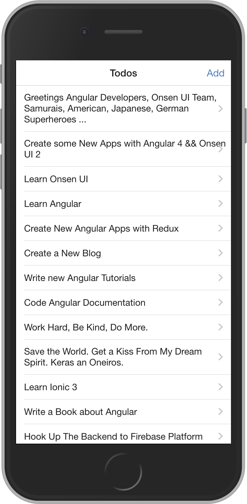
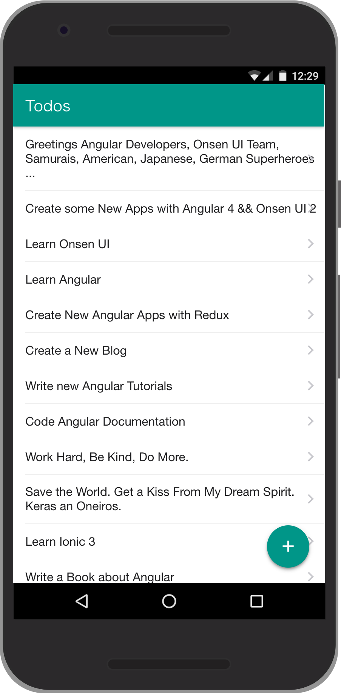

[![Build Status][travis-ci-image]][travis-ci-url]
[![Coverage Status][coveralls-image]][coveralls-url]
[![Dependency status][david-dm-image]][david-dm-url]
[![Dev Dependency status][david-dm-dev-image]][david-dm-dev-url]
# ngx-onsenui-ngrx-todo

|iOS|Android|
|--|--|
|||

A sample app using Onsen UI, Angular, ngrx and PhoneGap.

Try it here: [https://puku0x.github.io/ngx-onsenui-ngrx-todo/](https://puku0x.github.io/ngx-onsenui-ngrx-todo/).

## How to run it

To run it simply do:

```bash
npm install
npm start
```

The app will run at [http://localhost:3000](http://localhost:3000).

## How to build it

You can build it using PhoneGap.

- [Install Phonegap](http://docs.phonegap.com/getting-started/1-install-phonegap/cli/):

```
npm install -g phonegap
```

You need to build the project:


```
npm run build
```

Add a platform to run it on a device or emulator. For Android:

```
phonegap platform add android
phonegap run android
```

This assumes that you have the Android SDK installed.

## Contributing

1. Fork it ( https://github.com/puku0x/ngx-onsenui-ngrx-todo/fork )
2. Create your feature branch (`git checkout -b my-new-feature`)
3. Commit your changes (`git commit -am 'Add some feature'`)
4. Push to the branch (`git push origin my-new-feature`)
5. Create new Pull Request

[travis-ci-url]: http://travis-ci.org/puku0x/ngx-onsenui-ngrx-todo
[travis-ci-image]: https://travis-ci.org/puku0x/ngx-onsenui-ngrx-todo.svg?branch=master
[coveralls-url]: https://coveralls.io/github/puku0x/ngx-onsenui-ngrx-todo?branch=master
[coveralls-image]: https://coveralls.io/repos/github/puku0x/ngx-onsenui-ngrx-todo/badge.svg?branch=master
[david-dm-url]:https://david-dm.org/puku0x/ngx-onsenui-ngrx-todo
[david-dm-image]:https://david-dm.org/puku0x/ngx-onsenui-ngrx-todo.svg
[david-dm-dev-url]:https://david-dm.org/puku0x/ngx-onsenui-ngrx-todo?type=dev
[david-dm-dev-image]:https://david-dm.org/puku0x/ngx-onsenui-ngrx-todo/dev-status.svg

